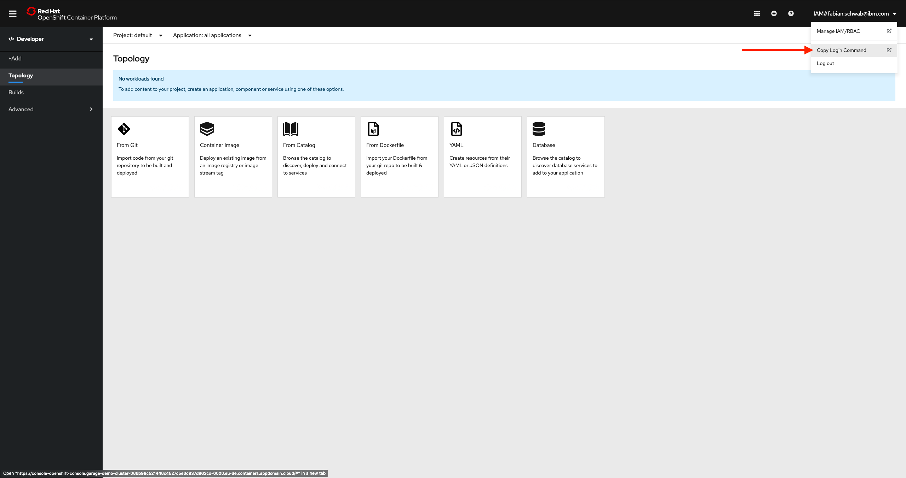
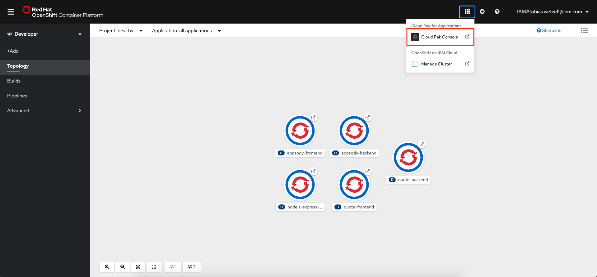
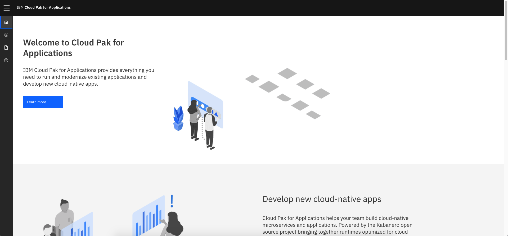

# Prerequisites

To complete the Cloud Pak for Applications exercises the following steps have to be performed.

## Accounts

If you don't have these accounts, please create them:

- [Github](https://github.com/)
- [IBM Cloud](https://cloud.ibm.com/)

## Tools and IDE

To perform all the steps in the exercises the following tools need to be installed on your machine:

- [Docker](https://docs.docker.com/desktop/#download-and-install)
- [Appsody CLI](https://appsody.dev/docs/getting-started/installation)
- [OpenShift CLI](https://www.okd.io/download.html)
- [VSCode](https://code.visualstudio.com/download) with [Codewind](https://code.visualstudio.com/download) extension

## Access to an OpenShift Cluster with Cloud Pak for Applications installed

You should have access to an OpenShift cluster with Cloud Pak for Applications installed.

Check the access by logging in from the command line. Therefore, click on your name in the top right corner and then select **Copy Login Command**. Click on **Display Token** and copy the command below the _"Log in with this token"_ section.



Open up a local terminal, paste the login command and execute it.

```bash
$ oc login https://... --token=XXX

Logged into "https://c100-e.eu-de.containers.cloud.ibm.com:30026" as "IAM#<your account>" using the token provided.

You have access to '<number of projects>' projects, the list has been suppressed. You can list all projects with 'oc projects'

Using project "default".
```

Cloud Pak for Applications should already have been installed in your managed OpenShift cluster. Check you have access to this by ensuring that Cloud Pak for Applications exists in the Application Console of your OpenShift cluster.



When clicked, the Cloud Pak for Applications landing page should appear:



You are now ready to start with the exercises
