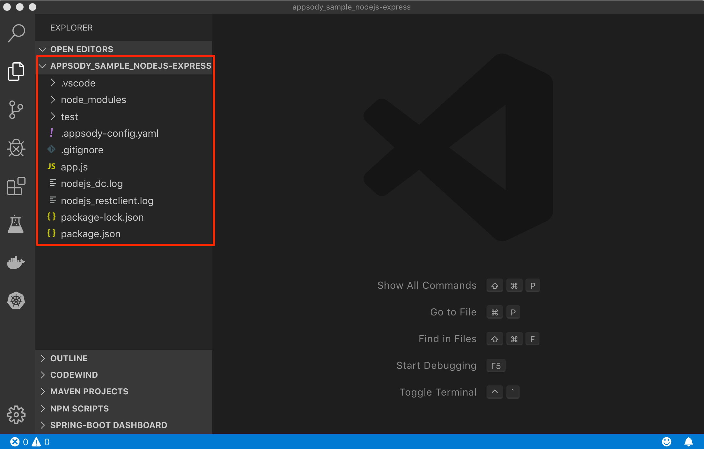
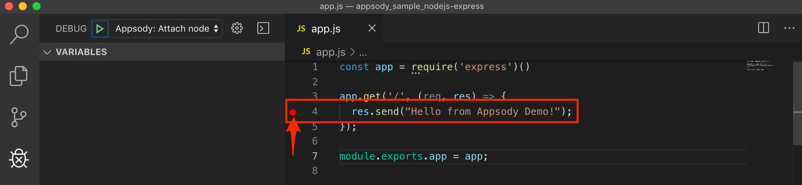

# Exercise 1: Introduction to Appsody and Codewind

In this exercise, we will introduce Appsody, which is the underpinning development flow in Kabanero, along with its integration into IDEs using Codewind. In particular you will become experienced with:

- the components of the Appsody development toolbox
- the concept of pre-configured "stacks" and templates for popular open source runtimes (such as Node.js and Spring Boot) on which to build applications
- the Appsody command-line interface to develop containerized applications, how to run and test them locally.

## Prequisites

You should have already carried out the tasks from `Prerequisites`. Check that you have access to the Appsody CLI, by executing the following command:

```bash
appsody version
```

The output should be:

```bash
$ appsody version
appsody 0.6.4
```

Make sure that docker is running as well!

## Configure the Appsody CLI

In this section we'll configure our Appsody CLI to pull in Collections.

### List existing Appsody stacks

The Appsody CLI gives you access to stacks, which are stored in stack repositories. These can be local, private to the Enterprise or public. To get the list of available repos, run this command.

```
appsody repo list
```

You should see output similar to the following:

```bash
$ appsody repo list
NAME            URL
*incubator      https://github.com/appsody/stacks/releases/latest/download/incubator-index.yaml
```

The exact repo list may be different to the above. `incubator` is one of the repos in the appsody project public hub (`appsodyhub`). For this workshop we are going to use the private enterprise-grade collection of stacks that come with the Kabanero open source project (which is part of Cloud Pak for Applications). So the first thing we need to do is to tell the CLI about this.

### Add Collection to Appsody

From the Cloud Pak for Applications instance page get the `Appsody URL`, for example:

https://github.com/kabanero-io/kabanero-stack-hub/releases/download/0.6.5/kabanero-stack-hub-index.yaml

Use the appsody CLI to add the Collection repo.

```bash
appsody repo add kabanero https://github.com/kabanero-io/kabanero-stack-hub/releases/download/0.6.5/kabanero-stack-hub-index.yaml
```

Now when we get our list of repos, we should see Kabanero listed:

```bash
appsody repo list
```

You should see output similar to the following:

```bash
$ appsody repo list

kabanero-0.6.5	https://github.com/kabanero-io/kabanero-stack-hub/releases/download/0.6.5/kabanero-stack-hub-index.yaml
*incubator      	https://github.com/appsody/stacks/releases/latest/download/incubator-index.yaml
```

We can now list the appsody stacks available in the Collection:

```bash
appsody list kabanero
```

You should see output similar to the following:

```bash
REPO          	ID                            	VERSION  	TEMPLATES        	DESCRIPTION
kabanero	java-microprofile [Deprecated]	0.2.26   	*default         	Eclipse MicroProfile on Open Liberty & OpenJ9 using Maven
kabanero	java-openliberty              	0.2.3    	*default         	Open Liberty & OpenJ9 using Maven
kabanero	java-spring-boot2             	0.3.28   	*default, kotlin 	Spring Boot using OpenJ9 and Maven
kabanero	nodejs                        	0.3.3    	*simple          	Runtime for Node.js applications
kabanero	nodejs-express                	0.2.10   	scaffold, *simple	Express web framework for Node.js
```

Given that we'll exclusively be using the kabanero stacks in this workshop, for ease of use we can set the kabanero repository to be the default for the CLI:

```bash
appsody repo set-default kabanero
```

Now is we get the list of repos, we should see kabanero is the default:

```bash
$ appsody repo list

*kabanero-0.6.5	https://github.com/kabanero-io/kabanero-stack-hub/releases/download/0.6.5/kabanero-stack-hub-index.yaml
incubator      	https://github.com/appsody/stacks/releases/latest/download/incubator-index.yaml
```

## Use Appsody CLI to build, test, run, and debug

In this section we'll be using the following appsody commands:

- `appsody init`
- `appsody run`
- `appsody test`
- `appsody debug`
- `appsody build`

### Create a new directory to work with new applications

We recommend creating a new directory from your user home to work with new Appsody based applications, i.e.:

```bash
cd ~
mkdir appsody-apps
cd appsody-apps
```

### Create a new application

We will now use one of the stacks to create an application. First, create a new directory for the project and change directory into it.

```bash
mkdir appsody_sample_nodejs-express
cd appsody_sample_nodejs-express/
```

Initialize the project using appsody init:

```bash
appsody init kabanero/nodejs-express
```

The directory has been initialized with a minimal set of artifacts (which is, in fact, a sample application that uses the chosen stack).

```dir
.
├── .appsody-config.yaml
├── .gitignore
├── .vscode
│  ├── launch.json
│  └── tasks.json
├── app.js
├── package-lock.json
├── package.json
└── test
    └── test.js
```

The key artifacts are:

- app.js Node.js application module (the default sample application is a simple "hello world")
- package.json NPM package JSON file
- test.js A simple test module

### Run the application

The sample application comes ready to run using appsody:

```bash
appsody run
```

This step results in the stack image, with the sample application mounted into it, run in your local Docker environment. The output finishes by giving you the endpoint for the application.

```bash
Running development environment...
Running command: docker pull kabanero/nodejs-express:0.2
Running docker command: docker run --rm -p 3000:3000 -p 8080:8080 -p 9229:9229 --name appsody-sample-nodejs-express-dev -v /Users/csantanapr/dev/kabanero/appsody_sample_nodejs-express/:/project/user-app -v appsody-sample-nodejs-express-deps:/project/user-app/node_modules -v /Users/csantanapr/.appsody/appsody-controller:/appsody/appsody-controller -t --entrypoint /appsody/appsody-controller kabanero/nodejs-express:0.2 --mode=run
[Container] Running APPSODY_PREP command: npm install --prefix user-app
audited 295 packages in 1.546s
[Container] found 0 vulnerabilities
[Container]
[Container] Running command:  npm start
[Container]
[Container] > nodejs-express@0.2.6 start /project
[Container] > node server.js
[Container]
[Container] [Sun Sep 22 23:29:50 2019] com.ibm.diagnostics.healthcenter.loader INFO: Node Application Metrics 5.0.5.201909191743 (Agent Core 4.0.5)
[Container] [Sun Sep 22 23:29:51 2019] com.ibm.diagnostics.healthcenter.mqtt INFO: Connecting to broker localhost:1883
[Container] App started on PORT 3000
```

We can now check that this is running by hitting the endpoint http://localhost:3000:

```bash
curl http://localhost:3000
```

You should see output similar to the following:

```bash
$ curl http://localhost:3000
Hello from Appsody!
```

By default, the template sample application also provides the following endpoints.

- Readiness endpoint: http://localhost:3000/ready
- Liveness endpoint: http://localhost:3000/live
- Health check endpoint: http://localhost:3000/health
- Metrics endpoint: http://localhost:3000/metrics

For more details on this particular stack, refer to Node.js Express Stack.

### Stop the application

To stop the application container, run this command from the same directory (e.g. in another terminal window):

```bash
appsody stop
```

### Test the application

A stack will typically come with a test framework - and this can be initiated by running:

```bash
appsody test
```

You should see output similar to the following:

```bash
$ appsody test
Running test environment
Running command: docker pull kabanero/nodejs-express:0.2
Running docker command: docker run --rm -p 3000:3000 -p 8080:8080 -p 9229:9229 --name appsody-sample-nodejs-express-dev -v /Users/csantanapr/dev/kabanero/appsody_sample_nodejs-express/:/project/user-app -v appsody-sample-nodejs-express-deps:/project/user-app/node_modules -v /Users/csantanapr/.appsody/appsody-controller:/appsody/appsody-controller -t --entrypoint /appsody/appsody-controller kabanero/nodejs-express:0.2 --mode=test
[Container] Running APPSODY_PREP command: npm install --prefix user-app
added 170 packages from 578 contributors and audited 295 packages in 2.76s
...
[Container] Running command:  npm test && npm test --prefix user-app
[Container]
[Container] > nodejs-express@0.2.6 test /project
[Container] > mocha
...
[Container] App started on PORT 3000
...
[Container]
[Container]   7 passing (44ms)
[Container]
[Container]
[Container] > nodejs-express-simple@0.1.0 test /project/user-app
[Container] > mocha
[Container]
...
[Container] App started on PORT 3000
[Container]   Node.js Express Simple template
[Container]     / endpoint
[Container]       ✓ status
[Container]
[Container]
[Container]   1 passing (40ms)
[Container]
[Container] The file watcher is not running because no APPSODY_RUN/TEST/DEBUG_ON_CHANGE action was specified or it has been disabled using the --no-watcher flag.
```

### Debug the application

As well as supporting the running and testing of your application, an appsody stack enables the execution of your application in debug mode. Typically the stack will be configured to support whatever the appropriate debugger is for the language and technology components within it.

Open an IDE for debugging the application. The examples here will be based on VS Code. After starting the IDE add the project to your workspace or launch VS Code using `code` from the application directory.



Open a new terminal window inside VS Code use `View` -> `Terminal`.

To debug the application including reloading the application on code changes run the below command:

```bash
appsody debug
```

The output indicates the debug environment is being used:

```bash
Running debug environment
Running command: docker pull kabanero/nodejs-express:0.2
Running docker command: docker run --rm -p 3000:3000 -p 8080:8080 -p 9229:9229 --name appsody-sample-nodejs-express-dev -v /Users/csantana23/dev/kabanero/appsody_sample_nodejs-express/:/project/user-app -v appsody-sample-nodejs-express-deps:/project/user-app/node_modules -v /Users/csantana23/.appsody/appsody-controller:/appsody/appsody-controller -t --entrypoint /appsody/appsody-controller kabanero/nodejs-express:0.2 --mode=debug
[Container] Running APPSODY_PREP command: npm install --prefix user-app
audited 295 packages in 1.154s
[Container] found 0 vulnerabilities
[Container]
[Container] Running command:  npm run debug
[Container]
[Container] > nodejs-express@0.2.6 debug /project
[Container] > node --inspect=0.0.0.0 server.js
[Container]
[Container] Debugger listening on ws://0.0.0.0:9229/35c7d2cb-ced9-4c57-94f1-a58a5e078302
[Container] For help, see: https://nodejs.org/en/docs/inspector
[Container] [Sun Sep 22 23:38:35 2019] com.ibm.diagnostics.healthcenter.loader INFO: Node Application Metrics 5.0.5.201909191743 (Agent Core 4.0.5)
[Container] [Sun Sep 22 23:38:35 2019] com.ibm.diagnostics.healthcenter.mqtt INFO: Connecting to broker localhost:1883
[Container] App started on PORT 3000
```

Now you can again open the application at http://localhost:3000/


Make an update to the application by opening the app.js file and editing the message. Then save the file.


Appsody will now rebuild the container and reload the application for you.
Refresh the browser to see the changes:


You can attach to the Node.js debugger using VS Code. To access the debug view use View -> Run or click Run/Debug icon on left menu:


Add a breakpoint to the application, click to the left of the line number:



Click on the debug task `Appsody: Attach node` and click the `Play` button:


Refresh the browser and watch how the debugger stops at the breakpoint:


Stop the VS Code debugging session (by pressing the red stop/disconnect icon). From the application directory, stop the appsody debug session by entering `appsody stop` in a terminal window.

### Build the application

Up until now, we have been using appsody in what we call "Rapid Local Development Mode", where we can cycle through code change, test and debug - all within a local Docker environment. Appsody is making this environment possible, through a combination of the CLI, the stack and appsody code within that stack. Once you are ready to deploy the application outside of appsody control, there are two additional appsody commands to help you.

These enable a couple of capabilities:

- support for building a standalone docker image (containing your application and the stack technologies), that can be deployed either using regular Docker commands, or manually to a kubernetes cluster.
- support deploying the final image directly to a kubernetes cluster, under control of the Appsody Operator. We will cover deployment in Exercise 3.

In this section we will carry out the first of these - i.e. simply building a standalone image. Perhaps unsurprisingly, this is enacted by:

```bash
appsody build
```

You should see output similar to the following:

```bash
$ appsody build
.
.
.
Docker] Step 72/73 : LABEL vendor=Kabanero
[Docker]  ---> Running in 32bcd8c86410
[Docker] Removing intermediate container 32bcd8c86410
[Docker]  ---> 1c0abd19bfdb
[Docker] Step 73/73 : LABEL version=0.2.10
[Docker]  ---> Running in 5348bd207c3c
[Docker] Removing intermediate container 5348bd207c3c
[Docker]  ---> ca16301abf59
[Docker] Successfully built e417d7dfc54c
[Docker] Successfully tagged appsody-sample-nodejs-express:latest
Built docker image appsody-sample-nodejs-express
```

We now have a standalone image (independent of appsody). We can view the image using our local Docker environment:

```bash
docker images
```

You should see output similar to the following:

```bash
$ docker images
REPOSITORY                                  TAG                 IMAGE ID            CREATED             SIZE
appsody-sample-nodejs-express               latest              0be125eee32c        3 minutes ago       945MB
```

We can run this with our local Docker environment in the normal way (making sure we map the exposed port):

```bash
docker run -p 3000:3000 appsody-sample-nodejs-express
```

You should see output similar to the following:

```bash
$ docker run -p 3000:3000 appsody-sample-nodejs-express
...
> nodejs-express@0.2.6 start /project
> node server.js
...
[Tue Oct  1 19:49:45 2019] com.ibm.diagnostics.healthcenter.loader INFO: Node Application Metrics 5.0.5.201910011945 (Agent Core 4.0.5)
[Tue Oct  1 19:49:46 2019] com.ibm.diagnostics.healthcenter.mqtt INFO: Connecting to broker localhost:1883
App started on PORT 3000
```

Again, hitting the endpoint of http://localhost:3000/ should give us the hello message.

You now have seen the basics of the appsody CLI in operation. We'll now take things up a level, and see how the CLI can be integrated into an IDE (VS Code in this case). Before we do this, terminate the current docker run using Ctrl-C.

## Appsody tasks on VS Code

To access the build tasks on VS code, go to: `Terminal` > `Run Build Task...`

You will see a list of available tasks:


Click on `Appsody: run` and this will run the application:


Once it is successfully started, you can, again, access the application at http://localhost:3000/.

## Codewind on VS Code

Codewind simplifies and enhances development in containers by extending industry-standard IDEs with features to write, debug, and deploy cloud-native applications. It helps you to get started quickly with templates or samples, or you can also pull in your applications and let Codewind get them cloud-ready.

Codewind supports VS Code, Eclipse Che, and Eclipse. In this lab, we are using VS Code as our IDE.

### Getting the Codewind Extension

Go to the extensions view and search for `Codewind` from the VS Code marketplace:


You will find `Codewind` then click `install` to get it. Also, if you want to use Codewind for Node.js performance analysis, you need to install `Codewind Node.js Profiler`.

Once installed, in VS Code, go to `View` > `Open View ...`. It gives you you a list of options. Select `Codewind` or type in `Codewind` if it does not show up.

This opens `Codewind`:


To start Codewind click on the toggle button next to `Local`. Your local Codewind environment should then be starting and turn green.


### Adding the Application

You can create a new project or add an existing project to Codewind. Since, we already created one using appsody earlier, we can add the existing project.

To add the project, right click (or Ctrl-click) on `Local` under `Codewind`. Select `Add Existing Project` in the menu.

Now, select the project you created earlier from the explorer and press `Add to Codewind`. The codewind extension asks you for confirmation as follows. Click `Yes`. The project will be added.

Once it is successfully built, it starts running:


### Project options

Go to the application and right click on it to access the various options available:


Click Open App to access the application:


> NOTE Codewind exposes your applications on different external ports. This will allow you to run multiple projects of same type.

To get the overview of your project, click on `Open Project Overview:`


You can access the container shell directly from the IDE by using `Open Container Shell`:


To access the logs of the application, click on `Show all logs`:


Feel free to also try out options such as `Hide all logs`, `Manage Logs` and `Restart in Run Mode` or `Restart in Debug Mode`.

You can access the application by clicking on the button as shown below:


### Application Performance, Monitor, Profiling with Codewind

You can launch the app monitor by selecting `Open Appplication Monitor`. The monitor dashboard will open in the browser:


You can launch the app performance dashboard by selecting `Open Performance Dashboard`. The performance dashboard will open in the browser:


You can click `Run Load Test` from the Performance Dashboardand have Monitor and Performance dashboards side by side during the test, to see some action:


**Congratulations!** You've just completed the intro exercises for Appsody and Codewind!
