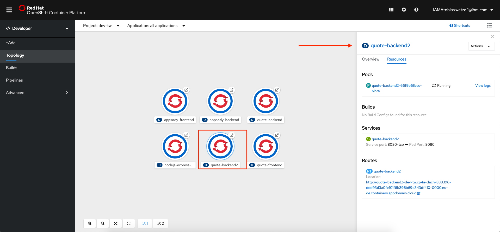
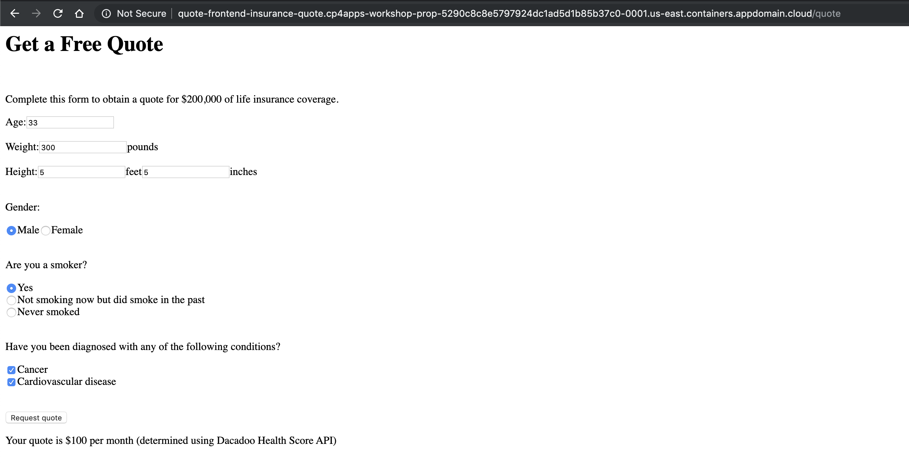

# Exercise 3: Deploying to OpenShift with Appsody

In Exercise 2 you were running the insurance quote application under "appsody control" in Local Rapid Development Mode (sometimes called the inner loop of development). In this exercise, we will show how to deploy the same application to OpenShift using Appsody.

Appsody provides the functionaliy to build a standard Docker image for your applicaiton (including all the components from stack), for deployment to Docker or Kubernetes, enabling additional testings within these environment. In particular:

- `appsody build` will create a Docker image
- `apposdy deploy` will deploy the image to a Kubernetes cluster, by default using the Appsody Operator. For simplicity, `appsody deploy` will also execute a build ahead of the deployment.

When you have completed this exercise, you will understand how to:

- deploy the applications to OpenShift using the appsody CLI

## Set up your project namespace

OpenShift applications are deployed within a project. So the first step is to create a new project, if you haven't done this already:

```bash
oc new-project <yourinitials>-dev
```

You should see output similar to the following:

```bash
$ oc new-project tw-dev
Now using project "tw-dev" on server "https://c100-e.us-east.containers.cloud.ibm.com:31718".

You can add applications to this project with the 'new-app' command. For example, try:

    oc new-app centos/ruby-25-centos7~https://github.com/sclorg/ruby-ex.git

to build a new example application in Ruby.
```

Check that the current context is your team’s project space.

```bash
oc project -q
```

## Access the internal Docker registry

We need a spot to push our newly built Docker images that Appsody created for us. Luckily, OpenShift comes with an internal Docker registry we can use. However, this registry is not enabled for public access by default.

To access the internal registry we need to create a route and expose it.

First check if there is already an existing route to the registry by running:

```bash
oc get route --all-namespaces | grep image-registry
```

If a route already exists, you get an output like this:

```bash
$ oc get route --all-namespaces | grep image-registry
openshift-image-registry   default-route                      default-route-openshift-image-registry.cp4a-dach-838396-ddd93d3a0fef01f6b396b69d343df410-0000.eu-de.containers.appdomain.cloud                               image-registry                     <all>              reencrypt            None
```

If no route exists, you have to create a route to expose the image registry, by running this command:

```bash
oc project openshift-image-registry
oc create route reencrypt registry --service=image-registry
```

Rerunning `oc get route` command should then show the newly created route, with a URL looking something like this: `registry-openshift-image-registry.cp4a-dach-....eu-de.containers.appdomain.cloud`.

Once we have the URL, set it as a variable (omit the protocol - no `https://` etc...):

```
export IMAGE_REGISTRY=<registry_url>
```

And set our local docker command to use that registry, use `docker login`:

```bash
oc whoami -t | docker login -u $(oc whoami) --password-stdin $IMAGE_REGISTRY
```

## Deploy the backend application to OpenShift

We will use the `appsody deploy` command for the deployments. This command:

- builds a deployment image for production usage (i.e. it does not include development-mode tools)
- pushes the image to your designated image registry
- builds a deployment yaml file (if you have not generated one already)
- applies the yaml file to your Kubernetes cluster

Appsody has the ability to deploy directly to a kubernetes cluster using a default deployment manifest. This will work if the cluster does not require any specific credentials. In this case, we will need to provide these, so appsody allows you to generate the deployment manifest it would have used, but without doing the actual deployment. We can then modify this, and then ask appsody to use it for the deployment of our applications.

### Deploy the backend application

Navigate to your `quote-backend` directory. The initial deployment yaml can be generated as follows.

```bash
cd ~/appsody-apps/quote-backend
appsody deploy --generate-only
```

This creates a file named `app-deploy.yaml` in your project.

```yaml
apiVersion: appsody.dev/v1beta1
kind: AppsodyApplication
metadata:
  name: quote-backend
  .
  .
spec:
  applicationImage: dev.local/quote-backend
  createKnativeService: false
  expose: true
  livenessProbe:
    failureThreshold: 12
    httpGet:
      path: /actuator/liveness
      port: 8080
    initialDelaySeconds: 5
    periodSeconds: 2
  monitoring:
    endpoints:
    - path: /actuator/prometheus
    labels:
      k8s-app: quote-backend2
  readinessProbe:
    failureThreshold: 12
    httpGet:
      path: /actuator/health
      port: 8080
    initialDelaySeconds: 5
    periodSeconds: 2
    timeoutSeconds: 1
  service:
    annotations:
      prometheus.io/path: /actuator/prometheus
      prometheus.io/scrape: "true"
    port: 8080
    type: NodePort
  stack: java-spring-boot2
  version: 1.0.0
```

Now use `appsody deploy` to push the image and deploy it. When using the OpenShift docker registry, the urls used to push and pull a given image are different. `appsody deploy` allows us to specify these on the command line:

```bash
appsody deploy --tag <your-namespace>/quote-backend:v1 --push-url $IMAGE_REGISTRY --push --pull-url image-registry.openshift-image-registry.svc:5000 --namespace <your-namespace>
```

```bash
$ appsody deploy --tag dev-tw/quote-backend:v2 --push-url $IMAGE_REGISTRY --push --pull-url docker-registry.default.svc:5000 --namespace dev-tw
.
.
[Docker] Successfully built e39b439971aa
[Docker] Successfully tagged registry-openshift-image-registry.cp4a-dach-838396-ddd93d3a0fef01f6b396b69d343df410-0000.eu-de.containers.appdomain.cloud/dev-tw/quote-backend:v2
Pushing image registry-openshift-image-registry.cp4a-dach-838396-ddd93d3a0fef01f6b396b69d343df410-0000.eu-de.containers.appdomain.cloud/dev-tw/quote-backend:v2
Built docker image registry-openshift-image-registry.cp4a-dach-838396-ddd93d3a0fef01f6b396b69d343df410-0000.eu-de.containers.appdomain.cloud/dev-tw/quote-backend:v2
Found existing deployment manifest /Users/tobias/workspaces/learning/cp4a/quote-backend2/app-deploy.yaml
Updated existing deployment manifest /Users/tobias/workspaces/learning/cp4a/quote-backend2/app-deploy.yaml
Attempting to get resource from Kubernetes ...
Running command: kubectl get pods "-o=jsonpath='{.items[?(@.metadata.labels.name==\"appsody-operator\")].metadata.namespace}'" --all-namespaces
Attempting to get resource from Kubernetes ...
Running command: kubectl get deployments "-o=jsonpath='{.items[?(@.metadata.name==\"appsody-operator\")].metadata.namespace}'" -n openshift-operators
Attempting to get resource from Kubernetes ...
Running command: kubectl get pod "-o=jsonpath='{.items[?(@.metadata.labels.name==\"appsody-operator\")].metadata.name}'" -n openshift-operators
Attempting to get resource from Kubernetes ...
Running command: kubectl exec -n openshift-operators -it appsody-operator-849cd8b475-p9klr -- /bin/printenv WATCH_NAMESPACE
An operator exists in namespace openshift-operators, that is watching all namespaces
Attempting to apply resource in Kubernetes ...
Running command: kubectl apply -f /Users/tobias/workspaces/learning/cp4a/quote-backend2/app-deploy.yaml --namespace dev-tw
Appsody Deployment name is: quote-backend2
Running command: kubectl get rt quote-backend2 -o "jsonpath=\"{.status.url}\"" --namespace dev-tw
Attempting to get resource from Kubernetes ...
Running command: kubectl get route quote-backend2 -o "jsonpath={.status.ingress[0].host}" --namespace dev-tw
Deployed project running at quote-backend2-dev-tw.cp4a-dach-838396-ddd93d3a0fef01f6b396b69d343df410-0000.eu-de.containers.appdomain.cloud
```

> NOTE: The deployment might take a while, because of the large image being pushed to the registry from your local machine.

After the deployment completes, you can test the service using curl. The last line output (above) in the deploy gives you the url to the backend application. For simplicity, let's put that in an environment variable, i.e, for the example above:

```bash
export  BACKEND_URL=quote-backend2-dev-tw.cp4a-dach-838396-ddd93d3a0fef01f6b396b69d343df410-0000.eu-de.containers.appdomain.cloud
```

```bash
curl -X POST -d @backend-input.json  -H "Content-Type: application/json"  http://$BACKEND_URL/quote
```

You should see output similar to the following:

```bash
$ curl -X POST -d @backend-input.json -H "Content-Type: application/json" http://$BACKEND_URL/quote
{"quotedAmount":30,"basis":"mocked backend computation"}
```

Navigating to the `Topology` in your project on OpenShift should now should the new deployment:



## Deploy the frontend application to OpenShift

We are now going to deploy the frontend application to OpenShift. The steps are similar to what we did for the backend application. The difference here is that we need to tell the frontend application how to talk to the backend application. The frontend will look at an environment variable `BACKEND_URL` to find the address of the backend, so we will set this in the application.

Now we could specify this as the actual exposed backend url we used earlier, however since both front and backend are running within the same cluster, it is better to use the service that is defined for the backend. You can see this by entering:

```bash
oc get services
```

which should produce something like:

```bash
$ oc get services
NAME             TYPE       CLUSTER-IP       EXTERNAL-IP   PORT(S)          AGE
quote-backend    NodePort   172.21.175.254   <none>        8080:32379/TCP   15m
```

In order to be able to reference this in the application, we first we need to generate the deployment yaml so that we can edit it. Change the current directory back to the frontend application and generate the deployment yaml.

```bash
cd ../quote-frontend
appsody deploy --generate-only
```

Edit the file that was created, `app-deploy.yaml`, and add the `env` section as shown below (which defines an environment variable with the URL of the backend application within the cluster). Replace the value of `BACKEND_URL` with the url of the backend you just deployed. Be careful to match the indentation (`env:` is indented the same number of spaces as `applicationImage:`):

```yaml
apiVersion: appsody.dev/v1beta1
kind: AppsodyApplication
metadata:
  name: quote-frontend
spec:
  applicationImage: dev.local/quote-frontend2
  createKnativeService: false
  env:
  - name: BACKEND_URL
    value: quote-backend2-dev-tw.cp4a-dach-838396-ddd93d3a0fef01f6b396b69d343df410-0000.eu-de.containers.appdomain.cloud/quote
  .
  .
  .
```

Save the yaml file and do the deployment.

```bash
appsody deploy --tag <your-namespace>/quote-frontend:v1 --push-url $IMAGE_REGISTRY --push --pull-url image-registry.openshift-image-registry.svc:5000 --namespace <your-namespace>
```

```bash
$ appsody deploy --tag dev-tw/quote-frontend2:v1 --push-url $IMAGE_REGISTRY --push --pull-url image-registry.openshift-image-registry.svc:5000 --namespace dev-tw
.
.
```

> NOTE: The deployment might take a while, because of the large image being pushed to the registry from your local machine.

You can then use a browser to open the frontend application, at the url given above (in the example above the URL is `quote-frontend-insurance-quote.cp4apps-workshop-prop-5290c8c8e5797924dc1ad5d1b85b37c0-0001.us-east.containers.appdomain.cloud`). Fill in the form and click the button to submit it. You should get a quote from the backend application.



**Congratulations**! You have now deployed both front and backend applications to OpenShift, hooked them together as well as enable outreach to an external service.

In general, using appsody to deploy your application in this fashion is recommended only to enable additional testing within a Docker or Kubernetes environment. As you are probably aware, using such a manual approach inside formal test, staging and production environments doesn't solve the problems of maintaining consistency, repeatability and control. In later exercises we will learn how to use appsody and kabanero to achieve these - using a Tekton pipeline, hooked to a git repository of the code of the application, ensuring triggering of automated builds and deployments. This is the recommended methodology supported by Kabanero and Cloud Pak for Applications
