# Exercise 4: Use Tekton and Kabanero Pipelines to continuously deploy

In this exercise we're going to take our insurance quote application from exercise 3 and instead of deploying it as a stand alone app, we will push the code up to a GitHub repo and use Tekton pipelines to automatically deploy the app to our OpenShift cluster and speed up your deployment process.

Recall that the application from exercise 3 consists of:

- a front-end constructed with Node.js (we used the `nodejs-express` collection)
- a back-end constructed with Java (we used the `java-spring-boot2` collection)

When you have completed this exercise, you will understand how to:

- leverage Tekton pipelines with Collections to deploy applications to OpenShift

## Prerequisites

You should have already carried out the prerequisites defined in Exercise 3, and in addition:

First we delete the deployments, run the `appsody deploy delete` command to remove them.

```bash
cd ~/appsody-apps/quote-frontend
appsody deploy delete --namespace <your-namespace>
cd ~/appsody-apps/quote-backend
appsody deploy delete --namespace <your-namespace>
```

You should see output similar to the following:

```bash
$ appsody deploy delete --namespace dev-tw
Deleting deployment using deployment manifest app-deploy.yaml
Attempting to delete resource from Kubernetes...
Running command: kubectl delete -f app-deploy.yaml --namespace dev-tw
Deployment deleted
```

We now still have the namespace, the the `appsody-operator` deployment, and the images in our registry.

## Launch the Tekton dashboard

You can launch the tekton dashboard by accessing the _Cloud Pak for Applications_ dashboard and selecting the Tekton link. Revisit the Pre-work section if unable to recall how to access the _Cloud Pak for Applications_ dashboard.

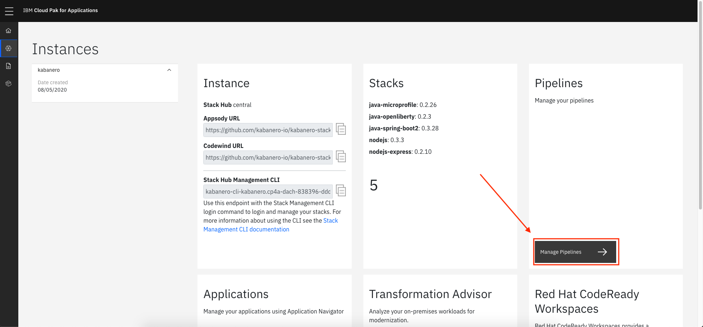

You can also obtain the URL for the tekton dashboard by using `oc get routes --all-namespace | grep tekton`. We want to use the address that looks like `tekton-dashboard-....xyz.domain.containers.appdomain.cloud`.

### Review pre-installed pipelines and tasks on Cloud Pak for Apps

There are multiple **Pipelines**, for collections kabanero comes with (java microprofile, spring, nodejs, express, and loopback) and also S2i pipelines. **Pipelines** are a first class structure in Tekton. **Pipelines** are a series of **Tasks**.

Run this command to see the available pipelines.

```bash
oc get pipeline -n kabanero
```

You will see something similar to this.

```bash
$ oc get pipeline -n kabanero
NAME                                           AGE
java-microprofile-build-deploy-pl    42d
java-microprofile-build-pl           42d
java-microprofile-build-push-jk-pl   42d
java-microprofile-build-push-pl      42d
java-microprofile-image-retag-pl     42d
java-openliberty-build-deploy-pl     42d
java-openliberty-build-pl            42d
java-openliberty-build-push-jk-pl    42d
java-openliberty-build-push-pl       42d
java-openliberty-image-retag-pl      42d
java-spring-boot2-build-deploy-pl    42d
java-spring-boot2-build-pl           42d
java-spring-boot2-build-push-jk-pl   42d
java-spring-boot2-build-push-pl      42d
java-spring-boot2-image-retag-pl     42d
nodejs-build-deploy-pl               42d
nodejs-build-pl                      42d
nodejs-build-push-jk-pl              42d
nodejs-build-push-pl                 42d
nodejs-express-build-deploy-pl       42d
nodejs-express-build-pl              42d
nodejs-express-build-push-jk-pl      42d
nodejs-express-build-push-pl         42d
nodejs-express-image-retag-pl        42d
nodejs-image-retag-pl                42d
```

These are visible through the UI, too:

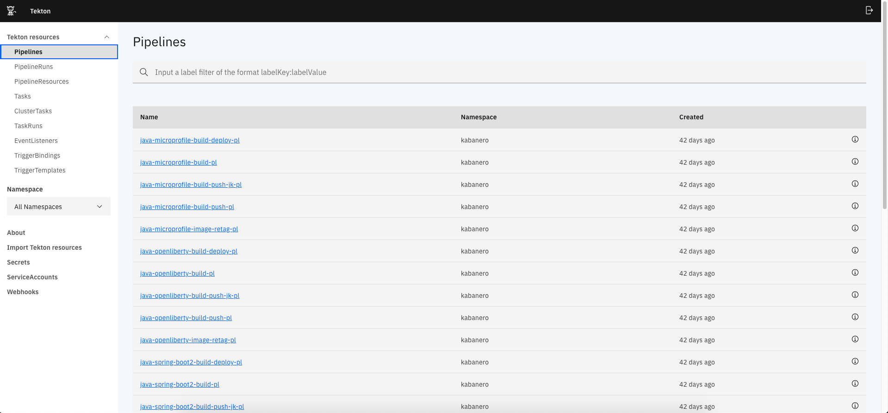

There are also multiple **Tasks**, that are used in the pipelines. To view the tasks, run the following command:

```bash
oc get tasks -n kabanero
```

You will see something similar to this.

```bash
$ oc get tasks -n kabanero
NAME                            AGE
java-microprofile-build-deploy-task     42d
java-microprofile-build-push-jk-task    42d
java-microprofile-build-push-task       42d
java-microprofile-build-task            42d
java-microprofile-deploy-task           42d
.
.
.
nodejs-express-image-scan-task          42d
nodejs-express-validate-stack-task      42d
nodejs-image-retag-task                 42d
nodejs-image-scan-task                  42d
nodejs-validate-stack-task              42d
```

These are visible through the UI, too:

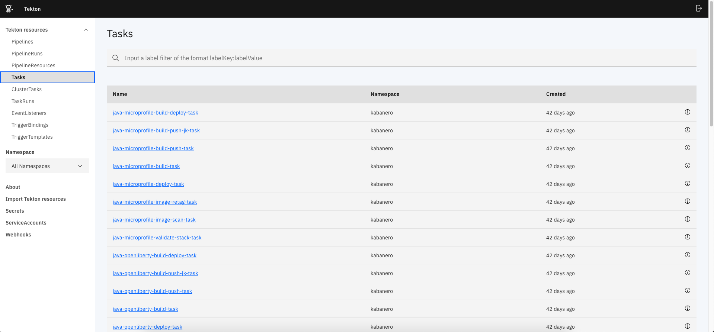

### Specify the namespce in `app-deploy.yml`

Go to your frontend code `cd ~/appsody-apps/quote-frontend` and update `app-deploy.yaml` to include the `namespace`, or if it is already there, make sure the correct namespace is supplied.

```yaml
apiVersion: appsody.dev/v1beta1
kind: AppsodyApplication
metadata:
  name: quote-frontend
  namespace: <your-namespace>`
```

Go to your backend code `cd ~/appsody-apps/quote-backend` and update `app-deploy.yaml` accordingly.

## Get a GitHub Access Token

When using Tekton, building a pipeline will require code to be pulled from either a public or private repository. When configuring Tekton, for security reasons, we will create an _Access Token_ instead of using a password.

To create an _Access Token_, from [Github.com](Github.com) click on your profile icon in the top left. Then go to `Settings` -> `Developer Settings` -> `Personal Access Tokens`. Or go directly to <https://github.com/settings/tokens>

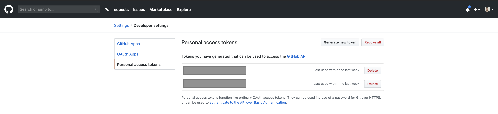

Here we want to generate a token, so `Click` on the `Generate a Token`. The token permissions need to be the `repo` which gives read and write access to the repository.

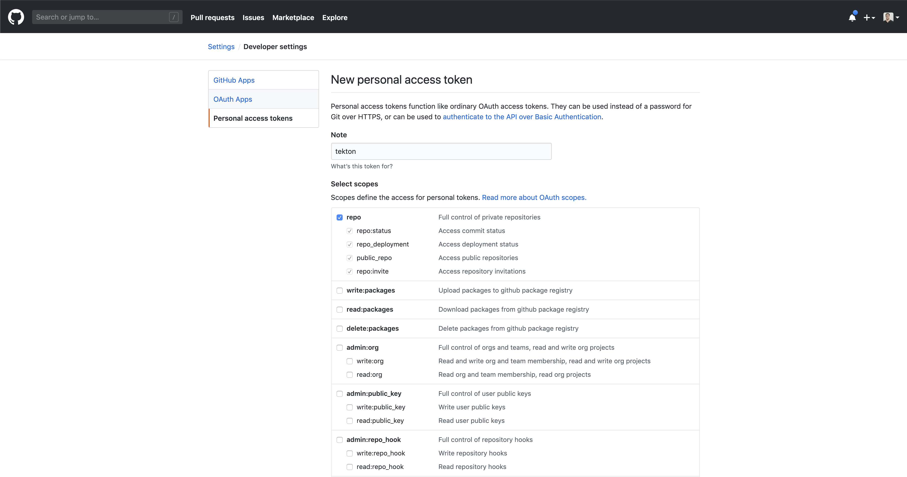

Once the token is created, make sure to copy it down. We will need it later.

## Upload insurance quote frontend, and backend to GitHub

Go to <https://github.com/new> and create two new repositories, `quote-frontend`, and `quote-backend`. Do not initiatize the repos with a license file or README.

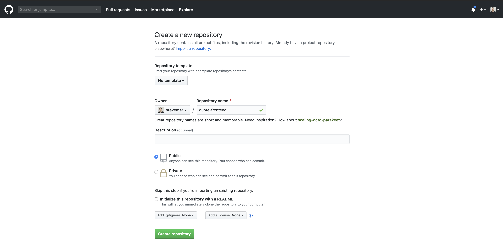

From your `quote-backend` directory, run the commands below, replacing `<username>` with your own.

```bash
git init
git add -A
git commit -m "o'zapft is"
git remote add origin git@github.com:<username>/quote-backend.git
git push -u origin master
```

The repo should now contain all the files.

From your `quote-frontend` directory, run the same commands, only changing the name of the repo to `quote-frontend.git`.

### 4. Add webhooks to Tekton to watch Github repo changes

Configure the GitHub webhook to your repo. Go to `Webhooks` > `Add Webhook` and then create the webhook.

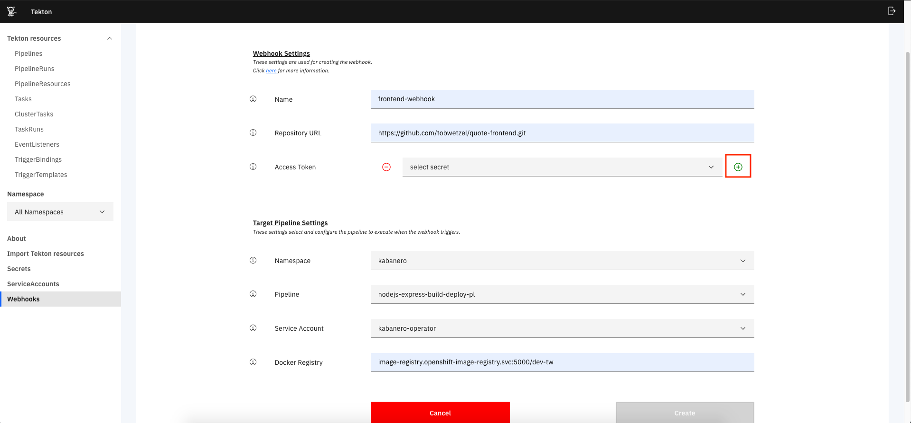

Note that the first time creating a webhook a new access token must also be created, use the access token from the earlier step:

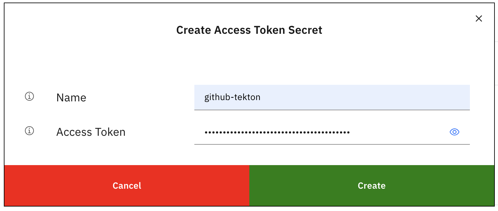

#### Create a webhook for the backend

```ini
Name: backend-webhook
Repository URL: http://github.com/{username}/quote-backend
Access Token: github-tekton

Namespace: kabanero
Pipeline: java-spring-boot2-build-deploy-pl
Service account: kabanero-operator
Docker Registry: image-registry.openshift-image-registry.svc:5000/{your-namespace}
```

#### Create a webhook for the frontend

```ini
Name: frontend-webhook
Repository URL: http://github.com/{username}/quote-frontend
Access Token: github-tekton

Namespace: kabanero
Pipeline: nodejs-express-build-deploy-pl
Service account: kabanero-operator
Docker Registry: image-registry.openshift-image-registry.svc:5000/{your-namespace}
```

Verify both are created successfully.

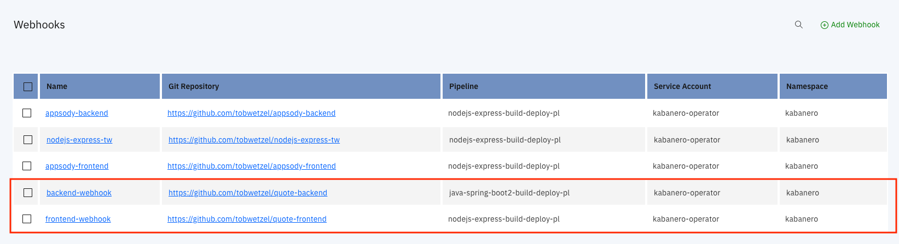

### Check Github repo settings

Go to the repo and check the settings tab to see the webhooks, Click the webhook

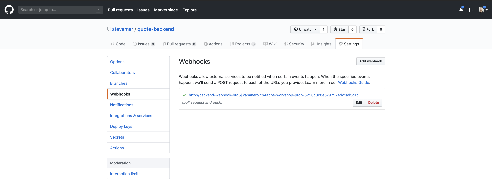

### Test it all out

In your `quote-backend` repo, change the file `quote-backend/src/main/java/application/Quote.java`. Change a value in a logger statement. Then commit this change and push to your github repo, for example:

```bash
git add -u
git commit -m "test change"
git push -f -u origin master
```

This will trigger the `java-spring-boot2-build-deploy` tekton pipeline. Go to the tekton dashboard and access the new pipeline run it created.

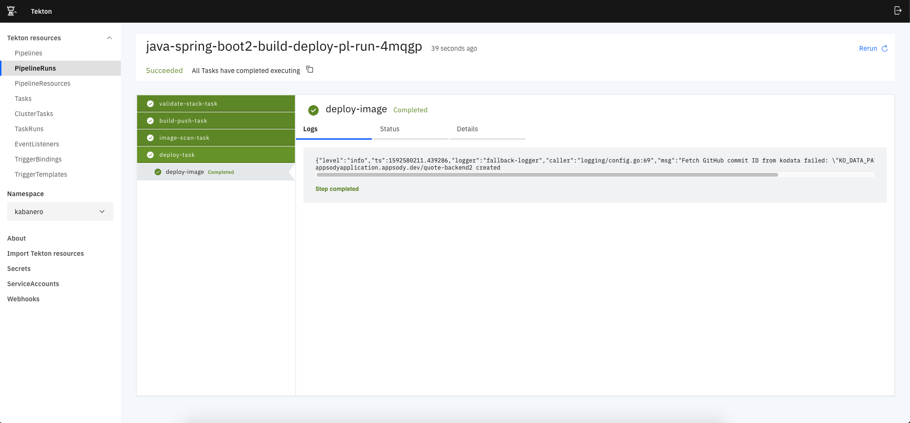

Wait until the task is complete, and then in your `quote-frontend` repo, change the file `quote-frontend/app.js`. Change a value in a comment statement. Then commit this change and push to your github repo, for example:

```bash
git add -u
git commit -m "test change"
git push -f -u origin master
```

This should trigger another pipeline run to be created, using the `nodejs-express-build-deploy` pipeline.

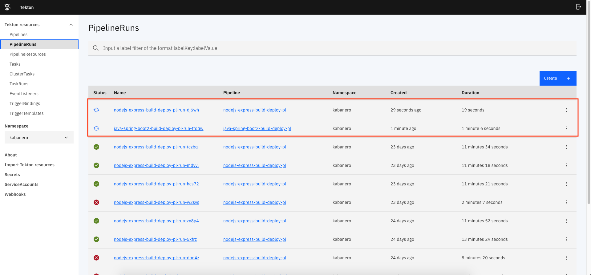

Wait until the task is complete, then find the route using `oc get routes`:

```bash
$ oc get routes -n insurance-quote | grep frontend
quote-frontend     quote-frontend-insurance-quote.cp4apps-workshop-prop-5290c8c8e5797924dc1ad5d1b85b37c0-0001.us-east.containers.appdomain.cloud
```

Open a browser to `http://<url-from-above>` and see the usual interface for the insurance quote app. Try entering information to ensure the frontend and backend are communicating.


**Congratulations**! You have deployed the sample application to OpenShift using Tekton. Day 1 of the workshop is now complete!
